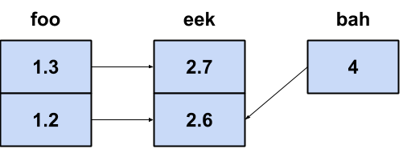
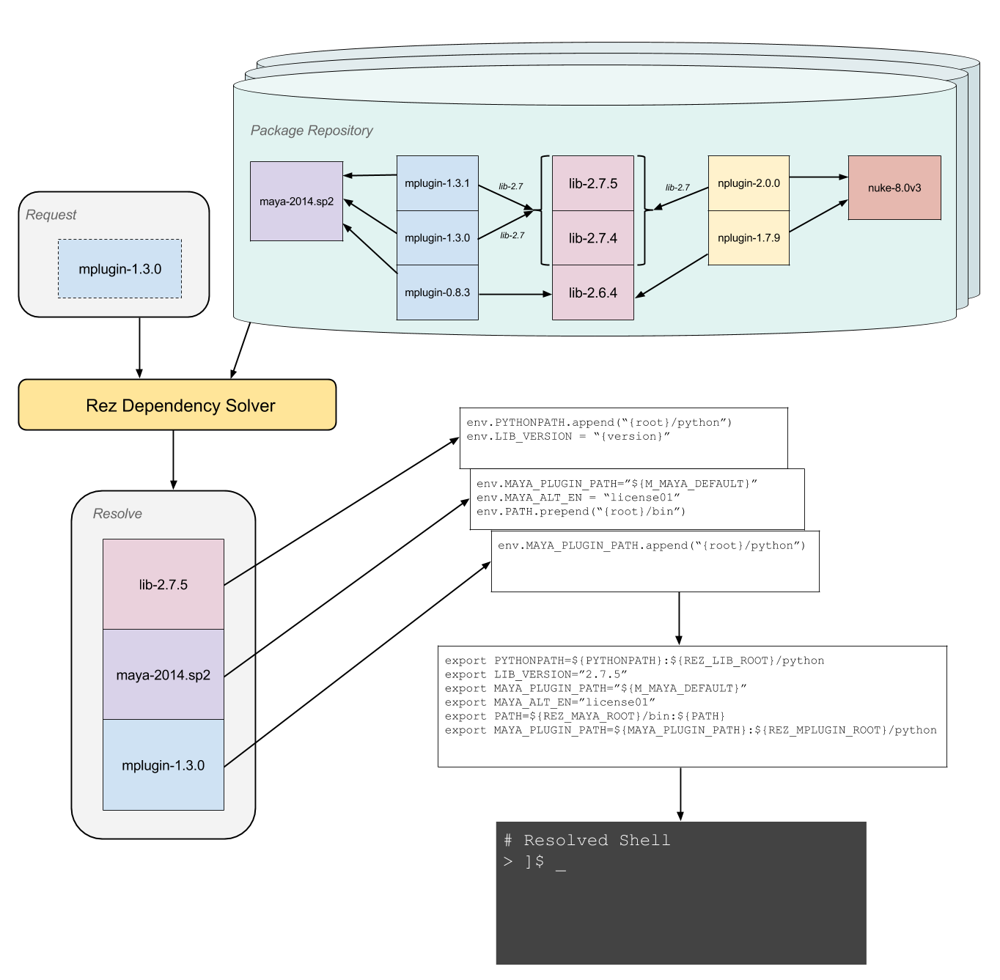

==============
Basic concepts
==============

Rez manages packages. You request a list of packages from rez, and it resolves this request, if
possible. If the resolution is not possible, the system supplies you with the relevant information
to determine why this is so. You typically want to resolve a list of packages because you want to
create an environment in which you can use them in combination, without conflicts occurring. A
conflict occurs when there is a request for two or more different versions of the same package.

Rez lets you describe the environment you want in a natural way. For example, you can say:
"I want an environment with...":

* the latest version of houdini
* maya-2009.1
* the latest rv and the latest maya and houdini-11.something
* rv-3.something or greater
* the latest houdini which works with boost-1.37.0
* PyQt-2.2 or greater, but less than PyQt-4.5.3

In many examples in this documentation we will use the
:ref:`rez-env` command line tool. This tool takes a list of package
requests and creates the resulting configured environment. It places you in a subshell. Simply
exit the shell to return to a non-configured environment.

.. _versions-concept:

Versions
========

Rez version numbers are alphanumeric (any combination of numbers, letters and
underscores). A version number is a set of *tokens*, separated by either dot or dash. For example,
here is a list of valid package version numbers:

* ``1``
* ``1.0.0``
* ``3.2.build_13``
* ``4.rc1``
* ``10a-5``

Version number tokens follow a strict ordering schema and are case sensitive. Underscore is the
smallest character, followed by letters (a-z and A-Z), followed by numbers. The ordering rules are
like so:

* Underscore before everything else;
* Letters alphabetical, and before numbers;
* Lowercase letters before uppercase;
* Zero-padded numbers before equivalent non-padded (or less padded) number (``01`` is smaller than ``1``);
* If a token contains a combination of numbers and letters, it is internally split into groups
  containing only numbers or only letters, and the resulting list is compared using the same rules
  as above.

The following table shows some example version token comparisons:

============= ============
smaller token larger token
============= ============
0             1
a             b
a             A
a             3
_5            2
ham           hamster
alpha         beta
alpha         bob
02            2
002           02
13            043
3             3a
beta3         3beta
============= ============

Versions are compared by their token lists. The token delimiter (usually dot, but can also be dash)
is ignored for comparison purposes, thus the versions ``1.0.0`` and ``1-0.0`` are equivalent. If two
versions share the same token list prefix, the longer version is greater, thus ``1.0.0`` is a higher
version than ``1.0``.

.. note::
   No special importance is given to specific characters or letters in Rez version numbers.
   The terms ``alpha`` and ``beta`` for example have no special meaning. Similarly, the number of tokens in
   a version number doesn't matter, you can have as many as you like.

   While you are encouraged to use semantic versioning (see `<https://semver.org>`_), it is not enforced. Please note
   that if you are using semantic versioning, version ordering will NOT behave like described in the semantic versioning
   2.0.0 spec.

   Ex. foo-1.0.0 < foo-1.0.0-beta.1

.. _packages-concept:

Packages
========

A *package* is a versioned piece of software, that may have dependencies on other packages. Packages
are self-contained. They have a single package definition file (typically ``package.py``), which
describes everything we need to know about the package in order to use it. Rez manages any kind of
package, whether it be a python package, compiled package, or simply build code or configuration
data.

Here is an example package definition file (see the :doc:`package definition guide <package_definition>` for further details
of each attribute):

.. code-block:: python

   name = "foo"

   version = "1.0.0"

   description = "Something that does foo-like things."

   requires = [
      "python-2.6",
      "utils-1.1+<2"
   ]

   tools = [
      "fooify"
   ]

   def commands():
      env.PYTHONPATH.append("{root}/python")
      env.PATH.append("{root}/bin")

The :attr:`requires` section defines the requirements of the package. The :func:`commands` section describes
what happens when this package is added to an environment. Here, the ``bin`` directory in the package
installation is appended to ``PATH``, and similarly the ``python`` subdirectory is appended to
``PYTHONPATH``.

.. _package-repositories-concept:

Package Repositories
====================

Packages are installed into package repositories.

.. caution::
   The following is an implementation of the filesystem repository plugin.

A package repository is a directory on disk, with
packages and their versions laid out in a known structure underneath. Going on with our (foo, bah,
eek) example, here is how the package repository might look:

.. code-block:: text

   /packages/inhouse/foo/1.1
                        /1.2
                        /1.3
   /packages/inhouse/bah/2
                        /3
                        /4
   /packages/inhouse/eek/2.5
                        /2.6
                        /2.7

   # more detailed example of foo-1.1
   /packages/inhouse/foo/1.1/package.py
                           /python/<PYTHON FILES>
                           /bin/<EXECUTABLES>

Here we have a package repository under the directory ``/packages/inhouse``. The actual package content
(files, executables etc) is installed into each leaf-node version directory, as shown for ``foo-1.1``.
The package definition file, in this case ``package.py``, is always stored at the root of the package,
right under the version directory for that package.

Rez only requires that the package's definition file is at the root of the package installation. The
layout of the rest of the package, for example the ``python`` and ``bin`` directories, is completely
up to the package's own build to determine. You should expect to see a package's ``commands`` section
match up with its installation though. For example, notice how the path for foo's python files and
binaries match what its package commands specified from earlier. ``{root}/python`` and ``{root}/bin``
will expand to these paths respectively.

.. _package-search-path-concept:

Package Search Path
===================

Rez finds packages using a search path in much the same way that python finds python modules using
``PYTHONPATH``. You can find out what the search path is, using the rez command line tool :ref:`rez-config`
(which you can also use to find any other rez setting):

.. code-block:: text

   ]$ rez-config packages_path
   - /home/ajohns/packages
   - /packages/inhouse
   - /packages/vendor

If the same package appears in two or more repositories on the search path, the earlier package is
used in preference. This happens at the version level. For example an earlier package ``foo-1.0.0``
will hide a later package ``foo-1.0.0``, but not ``foo-1.2.0``.

The example search path shown is a typical setting. There are some central repositories later in the
search path, where packages are released to so everyone can use them. But there is also a local
package path at the front of the search path. This is where packages go that are being locally
developed by a user. Having this at the start of the search-path allows developers to resolve
environments that pull in test packages in preference to released ones, so they can test a package
before releasing it for general use.

You can change the packages search path in several ways. A common way is to set the :envvar:`REZ_PACKAGES_PATH`
environment variable.

.. tip::
   See :doc:`configuring_rez` for more configuration options.

.. _package-commands-concept:

Package Commands
================

The :func:`commands` section of the package definition determines how the environment is configured in
order to use it. It is a python function, but note that if any imports are used, they must appear
within the body of this function.

Consider this commands example:

.. code-block:: python

   def commands():
      env.PYTHONPATH.append("{root}/python")
      env.PATH.append("{root}/bin")

This is a typical example, where a package adds its source path to ``PYTHONPATH``, and its tools to
``PATH``. See :doc:`here <package_commands>` for details on what can be done within the :func:`commands` section,
as well as details on what order package commands are executed in.

.. _package-requests-concept:

Package Requests
================

A *package request* is a string with a special syntax which matches a number of possible package
versions. You use package requests in the requires section of a package definition file, and also
when creating your own configured environment directly using tools such as :ref:`rez-env`.

For example, here is a request (using the :ref:`rez-env` tool) to create an environment containing
*python* version 2.6 or greater, and *my_py_utils* version 5.4 or greater, but less than 6:

.. code-block:: text

   ]$ rez-env 'python-2.6+' 'my_py_utils-5.4+<6'

Here are some example package requests:

=============== =================================== ======================================
Package request Description                         Example versions within request
=============== =================================== ======================================
foo             Any version of foo.                 foo-1, foo-0.4, foo-5.0, foo-2.0.alpha
foo-1           Any version of foo-1[.x.x...x].     foo-1, foo-1.0, foo-1.2.3
foo-1+          foo-1 or greater.                   foo-1, foo-1.0, foo-1.2.3, foo-7.0.0
foo-1.2+<2      foo-1.2 or greater, but less than 2 foo-1.2.0, foo-1.6.4, foo-1.99
foo<2           Any version of foo less than 2      foo-1, foo-1.0.4
foo==2.0.0      Only version 2.0.0 exactly          foo-2.0.0
foo-1.3\|5+     OR'd requests                       foo-1.3.0, foo-6.0.0
=============== =================================== ======================================

.. _conflict-operator-concept:

The Conflict Operator
---------------------

The ``!`` operator is called the *conflict* operator, and is used to define an incompatibility
between packages, or to specify that you do *not* want a package version present. For example,
consider the command:

.. code-block:: text

   ]$ rez-env maya_utils '!maya-2015.6'

This specifies that you require any version of ``maya_utils``, but that any version of ``maya`` within
2015.6 (and this includes 2015.6.1 and so on) is not acceptable.

.. _weak-references-concept:

Weak References
---------------

The ``~`` operator is called the *weak reference* operator. It forces a package version to be within
the specified range if present, but does not actually require the package. For example, consider
the command:

.. code-block:: text

   ]$ rez-env foo '~nuke-9.rc2'

This request may or may not pull in the ``nuke`` package, depending on the requirements of ``foo``.
However, if nuke *is* present, it must be within the version ``9.rc2``.

Weak references are useful in certain cases. For example, applications such as *nuke* and *maya*
sometimes ship with their own version of *python*. Their rez packages don't have a requirement on
*python* (they have their own embedded version already). However often other python libraries are
used both inside and outside of these applications, and those packages *do* have a python
requirement. So, to make sure that they're using a compatible python version when used within the
app, the app may define a *weak package reference* to their relevant python version, like so:

.. code-block:: python

   # in maya's package.py
   requires = [
      "~python-2.7.3"
   ]

This example ensures that any package that uses python, will use the version compatible with maya
when maya is present in the environment.

.. _implicit-packages-concept:

Implicit Packages
=================

The *implicit packages* are a list of package requests that are automatically added to every rez
request (for example, when you use :ref:`rez-env`). They are set by the configuration setting
:data:`implicit_packages`. The default setting looks like so:

.. todo:: document implicit_packages and make it referenceable

.. code-block:: python

   implicit_packages = [
      "~platform=={system.platform}",
      "~arch=={system.arch}",
      "~os=={system.os}",
   ]

Rez models the current system (the platform, architecture and operating systems) as packages
themselves. The default implicits are a set of *weak requirements* on each of ``platform``, ``arch`` and
``os``. This ensures that if any platform-dependent package is requested, the platform, architecture
and/or operating system it depends on, matches the current system.

The list of implicits that were used in a request are printed by :ref:`rez-env` when you enter the newly
configured subshell, and are also printed by the :ref:`rez-context` tool.

.. _dependency-resolving:

Dependency Resolving
====================

Rez contains a solving algorithm that takes a *request* (a list of package requests) and produces
a *resolve* (a final list of packages that satisfy the request). The algorithm avoids version
conflicts (two or more different versions of the same package at once).

When you submit a request to rez, it finds a solution for that request that aims to give you the
latest possible version of each package. If this is not possible, it will give you the next latest
version, and so on.

Consider the following example (the arrows indicate dependencies):

Here we have three packages, ``foo``, ``bah`` and ``eek``, where both foo and bah have dependencies on
eek. For example, package ``bah-4`` might have a package definition file that looks something like
this (some entries skipped for succinctness):

.. code-block:: python

   name = "bah"

   version = "4"

   requires = [
      "eek-2.6"
   ]

A request for ``foo-1.3`` is going to result in the resolve (``foo-1.3``, ``eek-2.7``). A request for
``foo`` will give the same result. We are asking for "any version of foo", but rez will prefer the
latest. However, if we request (``foo``, ``bah``), we are not going to get the latest of both because they
depend on different versions of eek, and that would cause a version conflict. Instead, our resolve
is going to be (``foo-1.2``, ``bah-4``, ``eek-2.6``). Rez has given you the latest possible versions of
packages, that do not cause a conflict.

Sometimes your request is impossible to fulfill. For example, the request (``foo-1.3``, ``bah-4``) is
not possible. In this case, the resolve will fail, and rez will inform you of the conflict.

Resolving An Environment
========================

A user can create a resolved environment using the command line tool :ref:`rez-env` (also via the API -
practically everything in rez can be done in python). When you create the environment, the current
environment is not changed. You are placed into a sub-shell instead. Here is an example of using
rez-env, assuming that the package repository is from our earlier (foo, bah, eek) example:

.. code-block:: text

   ]$ rez-env foo bah

   You are now in a rez-configured environment.

   resolved by ajohns@14jun01.methodstudios.com, on Wed Oct 22 12:44:00 2014,
   using Rez v2.0.rc1.10

   requested packages:
   foo
   bah

   resolved packages:
   eek-2.6   /packages/inhouse/eek/2.6
   foo-1.2   /packages/inhouse/foo/1.2
   bah-4     /packages/inhouse/bah/4

   > ]$ █

The output of rez-env shows the original request, along with the matching resolve. It's the resolve
that tells you what actual package versions are present in the newly resolved environment. Notice
the ``>`` character in the prompt. This is a visual cue telling you that you have been placed
into a rez-resolved environment.

Putting It All Together
-----------------------

Let's go through what happens when an environment is resolved, using a new (and slightly more
realistic) example.
Let us assume that the following packages are available:

* ``maya-2014.sp2``;
* ``nuke-8.0v3``;
* 3 versions of a maya plugin ``mplugin``;
* 2 versions of a nuke plugin ``nplugin``;
* 3 versions of a common base library ``lib``.

The following diagram shows what happens when the command ``rez-env mplugin-1.3.0`` is run:

The diagram shows the following operations occurring:

* Rez takes the user's request, and runs it through the dependency solver. The solver reads packages
  from the package repositories in order to complete the solve;
* This results in a list of resolved packages. These are the packages that are used in the
  configured environment;
* The commands from each package are concatenated together;
* This master list of commands is then translated into the target shell language (in this example
  that is ``bash``);
* A sub-shell is created and the translated command code is sourced within this environment,
  creating the final configured environment.

The order of package command execution depends on package dependencies, and the order that packages
were requested in. See :ref:`here <package-commands-order-of-execution>` for more details.
