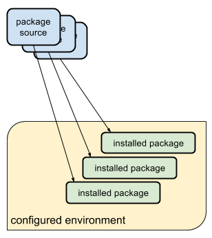
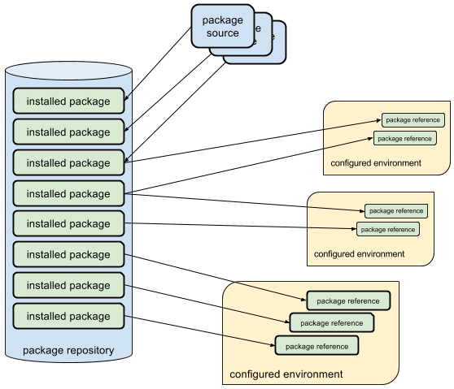

.. rez documentation master file, created by
   sphinx-quickstart on Sat Aug  5 19:30:28 2023.
   You can adapt this file completely to your liking, but it should at least
   contain the root `toctree` directive.

Welcome to rez's documentation!
===============================

.. toctree::
   :maxdepth: 2
   :caption: General
   :hidden:

   installation
   getting_started
   basic_concepts
   building_packages
   releasing_packages
   context
   variants
   guides/index

.. toctree::
   :maxdepth: 2
   :caption: Advanced
   :hidden:

   ephemerals
   context_bundles
   suites
   managing_packages
   caching
   pip
   plugins

.. toctree::
   :maxdepth: 2
   :caption: Package definition
   :hidden:

   package_definition
   package_commands

.. toctree::
   :maxdepth: 2
   :caption: Reference
   :hidden:

   configuring_rez
   commands_index
   environment
   api
   changelog.md

Rez is a cross-platform package manager with a difference. Using Rez you can create
standalone environments configured for a given set of packages. However, unlike many
other package managers, packages are not installed into these standalone environments.
Instead, all package versions are installed into a central repository, and standalone
environments reference these existing packages. This means that configured environments
are lightweight, and very fast to create, often taking just a few seconds to configure
despite containing hundreds of packages.

Traditional package manager:

   Typical package managers install packages into an environment

Rez:

   Rez installs packages once, and configures environments dynamically

Rez takes a list of package requests, and constructs the target environment, resolving
all the necessary package dependencies. Any type of software package is supported -
compiled, python, applications and libraries.

If you find a bug, need help, or want to talk to the developers, here is a list of the different
ways to get in touch with us:

* `Report an issue <https://github.com/AcademySoftwareFoundation/rez/issues>`_
* `Chat room <https://slack.aswf.io>`_: Join the ``#rez`` channel
* `Start a discussion <https://github.com/AcademySoftwareFoundation/rez/discussions>`_
* `Mailing list <mail:main@lists.aswf.io>`_: Note that are way less active on the mailing
  list than on any other communication channel.
