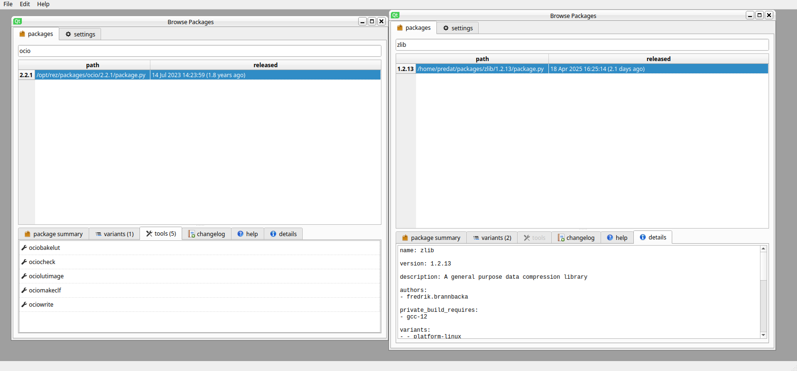
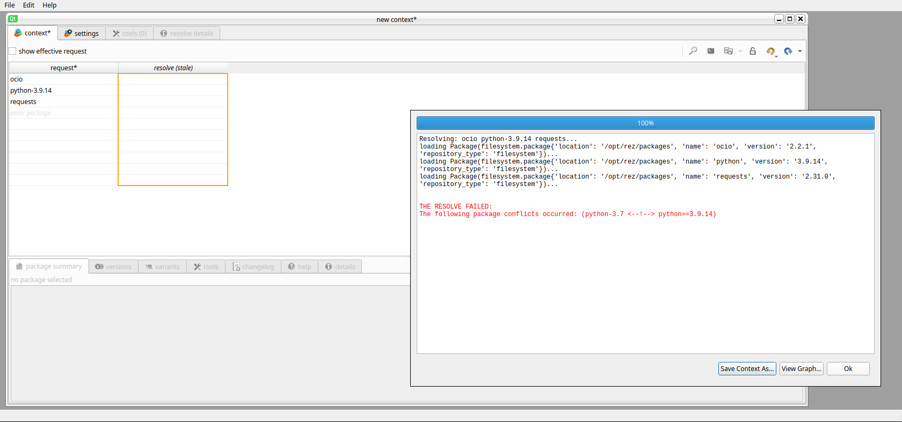

=======
Rez GUI
=======

Rez GUI is for opening context files, re-resolving them, graphically reviewing the diffs,
making alterations to the context file, graphing your solve, seeing conflicts, etc.

It’s not intended as an entrypoint into resolves, more like a diagnostic/debug tool that is
sometimes more user-friendly than interpreting an error on the CLI.

Rez GUI is NOT intended to be a software launcher that can be used by non-technical artists
in your studio.

To start, we need to install either PySide or PyQt to Rez's virtual Python environment.

.. note::
   The following install instructions have only been tested with Python versions 3.5 to 3.10.

   If you want to use a newer Python version, you will be unable to install PySide2 from PyPi
   and will need to build from source.

We have not tested rez-gui with Qt 6 yet, so any following commands will use Qt 5 packages.

To install PySide2 on the Windows commandline:

.. code-block:: console

   $ <path to rez install>/Scripts/pip install PySide2

To install PySide2 on Mac/Linux commandline:

.. code-block:: console

   $ <path to rez install>/bin/pip install PySide2

rez-gui also requires another Python package called ``Qt.py``. This is so that we can use any
flavor of Qt bindings for Python without changing code.

To install `Qt.py` on the Windows commandline:

.. code-block:: console

   $ <path to rez install>/Scripts/pip install Qt.py

To install `Qt.py` on the Mac/Linux commandline:

.. code-block:: console

   $ <path to rez install>/bin/pip install Qt.py

Now, rez-gui has all of its dependencies installed, and you can run rez-gui.
