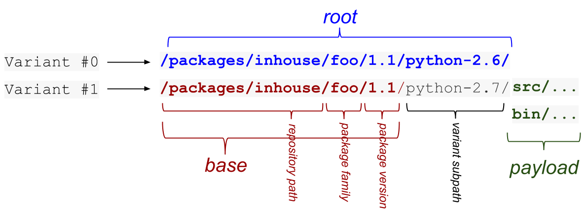

========
Variants
========

Packages in rez can contain different *variants*. Think of these as different
flavors of the same package version. Each variant has one or more package
dependencies that differ to the other variants in the same package.

Use of variants is best illustrated with an example. Consider a maya plugin,
``my_maya_plugin``. Let us assume that there are two active versions of maya
currently in use at your studio: ``2016.sp2`` and ``2017``. If your plugin is compiled,
you may need to build it separately for each maya version, even though the source
is no different.

You would use *variants* to create a version of your plugin that will work with
both maya versions. Consider the following package definition for our plugin:

.. code-block:: python

   name = "my_maya_plugin"

   version = "1.0.0"

   requires = [
      "openexr-2.2"
   ]

   variants = [
      ["maya-2016.sp2"],
      ["maya-2017"]
   ]

When you build and install this package, two separate builds will occur: one
using ``maya-2016.sp2``, and the other ``maya-2017``. When an environment is resolved
that includes ``my_maya_plugin``, the correct variant will be selected depending on
the version of maya present. Only one variant of a package is ever used in a
given configured environment.

Each variant entry is a list of dependencies, no different to the packages listed
in the :attr:`requires` field. These dependencies are appended to the ``requires`` list
for each variant. Thus the first variant requires ``openexr-2.2`` and ``maya-2016.sp1``,
and the second variant requires ``openexr-2.2`` and ``maya-2017``.

.. _variants-disk-structure:

Disk Structure
==============

Package variants are stored within the package, under subdirectories that match
the variant requirements. For example, continuing on with our ``my_maya_plugin``
package, the installation of that package would look like so:

.. code-block:: text

   /rez/packages/my_maya_plugin/1.0.0/maya-2016.sp2/<PAYLOAD>
                                     /maya-2017/<PAYLOAD>

The anatomy of a package with variants is illustrated in the following diagram:

The ``root`` of a package is the root directory of its current variant (the one
the current environment is configured to use); the ``base`` of a package is the
directory containing its variants. In a package that does not have variants,
``base`` and ``root`` are the same.

Hashed Variants
===============

There are two problems with the variant subpath as illustrated above:

* The variant install path can become long if there are many requirements;
* If some variant requirements contain characters such as ``!`` and ``<``, they
  can cause escaping problems that affect build systems; and, depending on the
  platform, may not be a valid filesystem path.

You can avoid these issues by using :attr:`hashed_variants`. This sets the variant
sub-path to a hash of its requirements, rather than the requirements themselves.
The resulting sub-directory is somewhat unwieldy (example:
``83e0c415db1b602f9d59cee028da6ac785e9bacc``). However, another feature,
:data:`variant shortlinks <use_variant_shortlinks>`, deals with this. A shortlink is a symlink to each variant,
created in a separate subdirectory (default ``_v``).

Here is an example hashed variant path:

.. code-block:: text

   /rez/packages/my_maya_plugin/1.0.0/83e0c415db1b602f9d59cee028da6ac785e9bacc

Here is the matching *shortlink*, which is what will be used in a resolved
environment:

.. code-block:: text

   /rez/packages/my_maya_plugin/1.0.0/_v/a

Hashed variants must be enabled explicitly for a package. To do this, simply set
this in your package definition:

.. code-block:: python

   hashed_variants = True

Platform As Variant
===================

It is not uncommon to see the platform, architecture and/or operating system
packages in package variants (recall that rez represents these as packages). For
example, you might see variants like this:

.. code-block:: python

   # in package.py
   variants = [
      ["platform-linux", "arch-x86_64", "os-Ubuntu-12.04"],
      ["platform-linux", "arch-x86_64", "os-Ubuntu-16.04"]
   ]

This indicates that the package has been built for multiple platforms. The correct
variant will be selected for you, because you probably have the relevant
:ref:`implicit packages <implicit-packages-concept>` set to limit packages to
the current platform.

Single Variants
===============

You may often see packages with just one variant. There are two reasons for this:

* *Future proofing*: Let's say you have a compiled package that links against python.
  It may currently support ``python-2.7``, however it's conceivable that support for
  newer python versions may be added later. **It is not possible to add new variants
  to a package that does not have any without changing/bumnig the version**. So by
  adding the ``python-2.7`` variant now, you can add variants later without needing
  to move to a newer version.
* *Installation path*: People often expect to see platform, architecture and/or
  operating system information in the installation path of a piece of software (and
  may also expect the same of python version, or other core packages). By putting
  these dependencies into a variant, we ensure that they appear in the installation
  path of the package.

Variant Selection
=================

As mentioned, rez will automatically select the correct variant of a package
depending on the environment being resolved. For example, consider:

.. code-block:: text

   ]$ rez-env my_maya_plugin maya-2017 -- echo '$REZ_MY_MAYA_PLUGIN_ROOT'
   /rez/packages/my_maya_plugin/1.0.0/maya-2017
   ]$ rez-env my_maya_plugin maya-2016 -- echo '$REZ_MY_MAYA_PLUGIN_ROOT'
   /rez/packages/my_maya_plugin/1.0.0/maya-2016.sp2

You can see how the correct variant (ie the one that does not conflict with other
packages in the request) has been selected. But what if both variants are valid
for the given request? Consider:

.. code-block:: text

   ]$ rez-env my_maya_plugin -- echo '$REZ_MY_MAYA_PLUGIN_ROOT'
   /rez/packages/my_maya_plugin/1.0.0/maya-2017

Here ``maya`` was not in the request. Either variant of ``my_maya_plugin`` would have
satisfied the request, since we have not specified which version of maya we actually
want.

By default, rez will prefer the variant with the higher-versioned packages, which
is why the ``maya-2017`` variant was selected in this example. If there are
multiple packages in the variant, priority is given to those that were in the request
list, if any; following that, priority is given to packages listed earlier in the
variant. For example, consider:

.. code-block:: python

   name = "foo"

   variants = [
      ["python-2.6", "maya-2017"],
      ["python-2.7", "maya-2016"]
   ]

If I run ``rez-env foo``, which variant will I get? The answer is not clear. In this
case it will be the second variant, since ``python`` is given priority (it is the
first listed package in the variant), and the second variant has the higher version
of python. However, if I ran ``rez-env foo maya``, I would get the ``first`` variant
because priority is now given to ``maya``, because it's listed in my request, and the
first variant has the higher version of maya.

The rez setting :data:`variant_select_mode` affects this selection behavior.
The default mode just described is ``version_priority``, but there is another mode called
``intersection_priority``. In this mode, variants are preferred that have *the most
number of packages present in the request*; version priority is secondary.

Mutual Exclusivity
------------------

In all the examples we've seen so far, a package's variants have been mutually
exclusive. For example, you cannot have both ``python-2.6`` and ``python-2.7`` in the
same environment, so when we request ``foo python-2.6`` we can be sure of which
variant we will get.

Variants, however, do not need to be mutually exclusive. In fact, you may use
variants in order to provide support for different DCCs for your package. Consider
a package with the following variants:

.. code-block:: python

   name = "geocache"

   variants = [
      ["maya-2016"],
      ["houdini-14"]
   ]

Which variant will I get if I run ``rez-env geocache``? Behavior in this case is
undefined. Rez gives no guarantees as to which variant will be selected. We cannot
meaningfully compare version numbers across packages, so maya will not have preference
simply because 2016 > 14. However, ``version_priority`` mode does give priority to
packages listed in the request. So if we ran ``rez-env geocache maya``, we will get
the first variant... probably.

Probably?
+++++++++

The operative word here is *preference*. Because the variants are not mutually
exclusive, we can't make guarantees. A resolve is still deterministic. You aren't
going to get differing results when requesting the same environment, but predicting
which variant you'll get can be tricky.

Consider the following request:

.. code-block:: text

   ]$ rez-env geocache maya animtools-1.4

We would expect to get the ``maya-2016`` variant of ``geocache``. However, what if
``animtools`` requires ``maya-2017``? This makes the first ``geocache`` variant impossible
to select, since a conflict would occur, and so the ``houdini`` variant of ``geocache``
will be selected. Quite possibly not what you expected.

.. todo:: Document this?
.. > [[media/icons/under_construction.png]] I plan on adding a new package request
.. > syntax, that is able to explicitly select package variants. This will avoid the
.. > ambiguity in cases like the one described here.

Why Use Variants?
=================

Variants are a powerful mechanism in rez. They avoid the need to maintain separate
branches of a package in order to support varying dependencies. You may have had
problems in the past where a common library depends on, say, boost, and is used in
various DCCs (maya, nuke etc), and depended on by many other packages in your
pipeline. When a DCC moves to a new version of boost (or python, or OIIO, etc)
you now have to branch this library, which potentially affects many other packages.
The problem gets worse if you have multiple dependencies with varying versions.

Variants solve that problem. You simply add another boost variant to your library,
and other dependent packages are not affected. Rez will correctly select the
package variant that does not conflict with the resolved environment.
