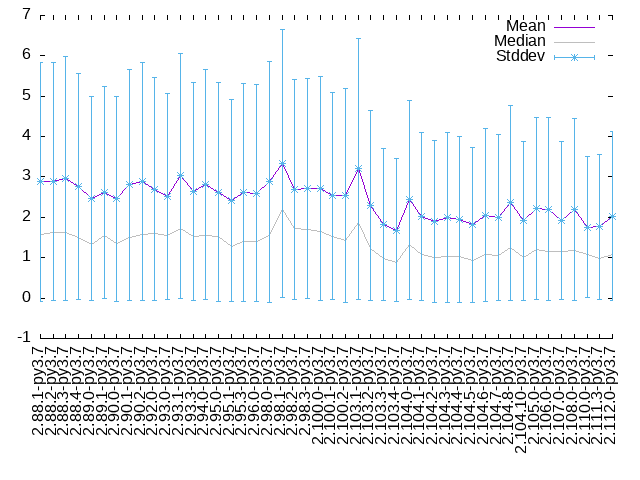

# Benchmarking Results

This document contains historical benchmarking results. These measure the speed
of resolution of a list of predetermined requests. Do **NOT** change this file
by hand; the 'benchmark' Github workflow does this automatically.

| Rez | Python | Platform | CPU | #CPU | Median | Mean | StdDev |
|-----|--------|----------|-----|------|--------|------|--------|
| 2.88.1 | 3.7 | Linux-5.4.0-1047-azure-x86_64-with-debian-bullseye-sid | Intel(R) Xeon(R) Platinum 8171M CPU @ 2.60GHz | 2 | 1.57 | 2.89 | 2.96 |
| 2.88.2 | 2.7 | Linux-5.4.0-1047-azure-x86_64-with-debian-bullseye-sid | Intel(R) Xeon(R) Platinum 8171M CPU @ 2.60GHz | 2 | 1.61 | 2.72 | 2.76 |
| 2.88.2 | 3.7 | Linux-5.4.0-1047-azure-x86_64-with-debian-bullseye-sid | Intel(R) Xeon(R) CPU E5-2673 v4 @ 2.30GHz | 2 | 1.62 | 2.89 | 2.94 |
| 2.88.3 | 2.7 | Linux-5.4.0-1047-azure-x86_64-with-debian-bullseye-sid | Intel(R) Xeon(R) CPU E5-2673 v4 @ 2.30GHz | 2 | 1.48 | 2.54 | 2.58 |
| 2.88.3 | 3.7 | Linux-5.4.0-1047-azure-x86_64-with-debian-bullseye-sid | Intel(R) Xeon(R) Platinum 8171M CPU @ 2.60GHz | 2 | 1.62 | 2.96 | 3.02 |
| 2.88.4 | 2.7 | Linux-5.4.0-1047-azure-x86_64-with-debian-bullseye-sid | Intel(R) Xeon(R) CPU E5-2673 v3 @ 2.40GHz | 2 | 1.65 | 2.81 | 2.82 |
| 2.88.4 | 3.7 | Linux-5.4.0-1047-azure-x86_64-with-debian-bullseye-sid | Intel(R) Xeon(R) Platinum 8171M CPU @ 2.60GHz | 2 | 1.50 | 2.76 | 2.81 |
| 2.89.0 | 2.7 | Linux-5.4.0-1047-azure-x86_64-with-debian-bullseye-sid | Intel(R) Xeon(R) Platinum 8171M CPU @ 2.60GHz | 2 | 1.68 | 2.92 | 2.97 |
| 2.89.0 | 3.7 | Linux-5.4.0-1047-azure-x86_64-with-debian-bullseye-sid | Intel(R) Xeon(R) Platinum 8272CL CPU @ 2.60GHz | 2 | 1.33 | 2.46 | 2.52 |
| 2.89.1 | 2.7 | Linux-5.4.0-1047-azure-x86_64-with-debian-bullseye-sid | Intel(R) Xeon(R) Platinum 8171M CPU @ 2.60GHz | 2 | 1.62 | 2.79 | 2.83 |
| 2.89.1 | 3.7 | Linux-5.4.0-1047-azure-x86_64-with-debian-bullseye-sid | Intel(R) Xeon(R) CPU E5-2673 v4 @ 2.30GHz | 2 | 1.56 | 2.61 | 2.63 |
| 2.90.0 | 2.7 | Linux-5.4.0-1047-azure-x86_64-with-debian-bullseye-sid | Intel(R) Xeon(R) CPU E5-2673 v4 @ 2.30GHz | 2 | 1.68 | 2.94 | 2.97 |
| 2.90.0 | 3.7 | Linux-5.4.0-1047-azure-x86_64-with-debian-bullseye-sid | Intel(R) Xeon(R) Platinum 8171M CPU @ 2.60GHz | 2 | 1.36 | 2.46 | 2.54 |
| 2.90.1 | 2.7 | Linux-5.4.0-1047-azure-x86_64-with-debian-bullseye-sid | Intel(R) Xeon(R) Platinum 8171M CPU @ 2.60GHz | 2 | 1.59 | 2.75 | 2.80 |
| 2.90.1 | 3.7 | Linux-5.4.0-1047-azure-x86_64-with-debian-bullseye-sid | Intel(R) Xeon(R) CPU E5-2673 v3 @ 2.40GHz | 2 | 1.50 | 2.80 | 2.86 |
| 2.90.2 | 2.7 | Linux-5.8.0-1033-azure-x86_64-with-debian-bullseye-sid | Intel(R) Xeon(R) Platinum 8171M CPU @ 2.60GHz | 2 | 1.61 | 2.72 | 2.78 |
| 2.90.2 | 3.7 | Linux-5.8.0-1033-azure-x86_64-with-debian-bullseye-sid | Intel(R) Xeon(R) Platinum 8171M CPU @ 2.60GHz | 2 | 1.58 | 2.89 | 2.95 |
| 2.92.0 | 2.7 | Linux-5.8.0-1036-azure-x86_64-with-debian-bullseye-sid | Intel(R) Xeon(R) Platinum 8171M CPU @ 2.60GHz | 2 | 1.53 | 2.65 | 2.68 |
| 2.92.0 | 3.7 | Linux-5.8.0-1036-azure-x86_64-with-debian-bullseye-sid | Intel(R) Xeon(R) Platinum 8171M CPU @ 2.60GHz | 2 | 1.61 | 2.70 | 2.77 |
| 2.93.0 | 2.7 | Linux-5.8.0-1036-azure-x86_64-with-debian-bullseye-sid | Intel(R) Xeon(R) Platinum 8171M CPU @ 2.60GHz | 2 | 1.42 | 2.55 | 2.57 |
| 2.93.0 | 3.7 | Linux-5.8.0-1036-azure-x86_64-with-debian-bullseye-sid | Intel(R) Xeon(R) Platinum 8272CL CPU @ 2.60GHz | 2 | 1.56 | 2.52 | 2.56 |
| 2.93.1 | 2.7 | Linux-5.8.0-1039-azure-x86_64-with-debian-bullseye-sid | Intel(R) Xeon(R) CPU E5-2673 v4 @ 2.30GHz | 2 | 1.98 | 3.19 | 3.20 |
| 2.93.1 | 3.7 | Linux-5.8.0-1039-azure-x86_64-with-debian-bullseye-sid | Intel(R) Xeon(R) CPU E5-2673 v4 @ 2.30GHz | 2 | 1.73 | 3.03 | 3.03 |
| 2.93.3 | 2.7 | Linux-5.8.0-1039-azure-x86_64-with-debian-bullseye-sid | Intel(R) Xeon(R) Platinum 8171M CPU @ 2.60GHz | 2 | 1.57 | 2.65 | 2.70 |
| 2.93.3 | 3.7 | Linux-5.8.0-1039-azure-x86_64-with-debian-bullseye-sid | Intel(R) Xeon(R) CPU E5-2673 v4 @ 2.30GHz | 2 | 1.52 | 2.65 | 2.70 |
| 2.94.0 | 2.7 | Linux-5.8.0-1039-azure-x86_64-with-debian-bullseye-sid | Intel(R) Xeon(R) Platinum 8171M CPU @ 2.60GHz | 2 | 1.68 | 2.79 | 2.83 |
| 2.94.0 | 3.7 | Linux-5.8.0-1039-azure-x86_64-with-debian-bullseye-sid | Intel(R) Xeon(R) CPU E5-2673 v4 @ 2.30GHz | 2 | 1.54 | 2.81 | 2.84 |
| 2.95.0 | 2.7 | Linux-5.8.0-1041-azure-x86_64-with-debian-bullseye-sid | Intel(R) Xeon(R) CPU E5-2673 v3 @ 2.40GHz | 2 | 1.58 | 2.72 | 2.73 |
| 2.95.0 | 3.7 | Linux-5.8.0-1041-azure-x86_64-with-debian-bullseye-sid | Intel(R) Xeon(R) Platinum 8272CL CPU @ 2.60GHz | 2 | 1.52 | 2.62 | 2.71 |
| 2.95.1 | 2.7 | Linux-5.8.0-1042-azure-x86_64-with-debian-bullseye-sid | Intel(R) Xeon(R) Platinum 8171M CPU @ 2.60GHz | 2 | 1.47 | 2.47 | 2.55 |
| 2.95.1 | 3.7 | Linux-5.8.0-1042-azure-x86_64-with-debian-bullseye-sid | Intel(R) Xeon(R) Platinum 8171M CPU @ 2.60GHz | 2 | 1.28 | 2.42 | 2.49 |
| 2.95.2 | 2.7 | Linux-5.8.0-1042-azure-x86_64-with-debian-bullseye-sid | Intel(R) Xeon(R) Platinum 8171M CPU @ 2.60GHz | 2 | 1.71 | 2.84 | 2.89 |
| 2.95.3 | 2.7 | Linux-5.8.0-1042-azure-x86_64-with-debian-bullseye-sid | Intel(R) Xeon(R) Platinum 8272CL CPU @ 2.60GHz | 2 | 1.52 | 2.53 | 2.60 |
| 2.95.3 | 3.7 | Linux-5.8.0-1042-azure-x86_64-with-debian-bullseye-sid | Intel(R) Xeon(R) Platinum 8272CL CPU @ 2.60GHz | 2 | 1.40 | 2.61 | 2.71 |
| 2.96.0 | 2.7 | Linux-5.8.0-1042-azure-x86_64-with-debian-bullseye-sid | Intel(R) Xeon(R) Platinum 8272CL CPU @ 2.60GHz | 2 | 1.39 | 2.35 | 2.46 |
| 2.96.0 | 3.7 | Linux-5.8.0-1042-azure-x86_64-with-debian-bullseye-sid | Intel(R) Xeon(R) Platinum 8272CL CPU @ 2.60GHz | 2 | 1.41 | 2.60 | 2.68 |
| 2.98.0 | 2.7 | Linux-5.8.0-1042-azure-x86_64-with-debian-bullseye-sid | Intel(R) Xeon(R) Platinum 8171M CPU @ 2.60GHz | 2 | 1.73 | 2.88 | 2.93 |
| 2.98.0 | 3.7 | Linux-5.8.0-1042-azure-x86_64-with-debian-bullseye-sid | Intel(R) Xeon(R) CPU E5-2673 v4 @ 2.30GHz | 2 | 1.54 | 2.88 | 2.98 |
| 2.98.1 | 2.7 | Linux-5.11.0-1021-azure-x86_64-with-debian-bullseye-sid | Intel(R) Xeon(R) Platinum 8272CL CPU @ 2.60GHz | 2 | 1.54 | 2.57 | 2.63 |
| 2.98.1 | 3.7 | Linux-5.11.0-1021-azure-x86_64-with-debian-bullseye-sid | Intel(R) Xeon(R) CPU E5-2673 v4 @ 2.30GHz | 2 | 2.19 | 3.32 | 3.32 |
| 2.98.2 | 2.7 | Linux-5.11.0-1021-azure-x86_64-with-debian-bullseye-sid | Intel(R) Xeon(R) Platinum 8272CL CPU @ 2.60GHz | 2 | 1.56 | 2.62 | 2.70 |
| 2.98.2 | 3.7 | Linux-5.11.0-1021-azure-x86_64-with-debian-bullseye-sid | Intel(R) Xeon(R) Platinum 8171M CPU @ 2.60GHz | 2 | 1.72 | 2.69 | 2.72 |
| 2.98.3 | 2.7 | Linux-5.11.0-1021-azure-x86_64-with-debian-bullseye-sid | Intel(R) Xeon(R) CPU E5-2673 v4 @ 2.30GHz | 2 | 1.66 | 2.74 | 2.80 |
| 2.98.3 | 3.7 | Linux-5.11.0-1021-azure-x86_64-with-debian-bullseye-sid | Intel(R) Xeon(R) CPU E5-2673 v4 @ 2.30GHz | 2 | 1.71 | 2.72 | 2.73 |
| 2.100.0 | 2.7 | Linux-5.11.0-1021-azure-x86_64-with-debian-bullseye-sid | Intel(R) Xeon(R) Platinum 8171M CPU @ 2.60GHz | 2 | 1.74 | 2.91 | 2.96 |
| 2.100.0 | 3.7 | Linux-5.11.0-1021-azure-x86_64-with-debian-bullseye-sid | Intel(R) Xeon(R) Platinum 8171M CPU @ 2.60GHz | 2 | 1.64 | 2.72 | 2.78 |
| 2.100.1 | 2.7 | Linux-5.11.0-1021-azure-x86_64-with-debian-bullseye-sid | Intel(R) Xeon(R) Platinum 8272CL CPU @ 2.60GHz | 2 | 1.46 | 2.44 | 2.51 |
| 2.100.1 | 3.7 | Linux-5.11.0-1021-azure-x86_64-with-debian-bullseye-sid | Intel(R) Xeon(R) Platinum 8272CL CPU @ 2.60GHz | 2 | 1.53 | 2.53 | 2.56 |
| 2.100.2 | 2.7 | Linux-5.11.0-1021-azure-x86_64-with-debian-bullseye-sid | Intel(R) Xeon(R) Platinum 8272CL CPU @ 2.60GHz | 2 | 1.36 | 2.27 | 2.33 |
| 2.100.2 | 3.7 | Linux-5.11.0-1021-azure-x86_64-with-debian-bullseye-sid | Intel(R) Xeon(R) Platinum 8171M CPU @ 2.60GHz | 2 | 1.44 | 2.54 | 2.64 |
| 2.103.1 | 2.7 | Linux-5.11.0-1021-azure-x86_64-with-debian-bullseye-sid | Intel(R) Xeon(R) Platinum 8272CL CPU @ 2.60GHz | 2 | 1.53 | 2.57 | 2.67 |
| 2.103.1 | 3.7 | Linux-5.11.0-1021-azure-x86_64-with-debian-bullseye-sid | Intel(R) Xeon(R) CPU E5-2673 v4 @ 2.30GHz | 2 | 1.86 | 3.20 | 3.24 |
| 2.103.2 | 2.7 | Linux-5.11.0-1022-azure-x86_64-with-debian-bullseye-sid | Intel(R) Xeon(R) Platinum 8171M CPU @ 2.60GHz | 2 | 1.50 | 2.56 | 2.61 |
| 2.103.2 | 3.7 | Linux-5.11.0-1022-azure-x86_64-with-debian-bullseye-sid | Intel(R) Xeon(R) Platinum 8272CL CPU @ 2.60GHz | 2 | 1.23 | 2.29 | 2.35 |
| 2.103.3 | 2.7 | Linux-5.11.0-1022-azure-x86_64-with-debian-bullseye-sid | Intel(R) Xeon(R) CPU E5-2673 v4 @ 2.30GHz | 2 | 1.34 | 2.62 | 2.85 |
| 2.103.3 | 3.7 | Linux-5.11.0-1022-azure-x86_64-with-debian-bullseye-sid | Intel(R) Xeon(R) Platinum 8272CL CPU @ 2.60GHz | 2 | 0.98 | 1.83 | 1.88 |
| 2.103.4 | 2.7 | Linux-5.11.0-1022-azure-x86_64-with-debian-bullseye-sid | Intel(R) Xeon(R) Platinum 8272CL CPU @ 2.60GHz | 2 | 1.26 | 2.28 | 2.38 |
| 2.103.4 | 3.7 | Linux-5.11.0-1022-azure-x86_64-with-debian-bullseye-sid | Intel(R) Xeon(R) Platinum 8272CL CPU @ 2.60GHz | 2 | 0.88 | 1.68 | 1.78 |
| 2.104.0 | 2.7 | Linux-5.11.0-1028-azure-x86_64-with-debian-bullseye-sid | Intel(R) Xeon(R) CPU E5-2673 v4 @ 2.30GHz | 2 | 1.75 | 2.84 | 2.89 |
| 2.104.0 | 3.7 | Linux-5.11.0-1028-azure-x86_64-with-debian-bullseye-sid | Intel(R) Xeon(R) CPU E5-2673 v4 @ 2.30GHz | 2 | 1.33 | 2.43 | 2.47 |
| 2.104.1 | 2.7 | Linux-5.11.0-1028-azure-x86_64-with-debian-bullseye-sid | Intel(R) Xeon(R) Platinum 8272CL CPU @ 2.60GHz | 2 | 1.34 | 2.22 | 2.28 |
| 2.104.1 | 3.7 | Linux-5.11.0-1028-azure-x86_64-with-debian-bullseye-sid | Intel(R) Xeon(R) Platinum 8171M CPU @ 2.60GHz | 2 | 1.07 | 2.01 | 2.08 |
| 2.104.2 | 2.7 | Linux-5.11.0-1028-azure-x86_64-with-debian-bullseye-sid | Intel(R) Xeon(R) Platinum 8272CL CPU @ 2.60GHz | 2 | 1.36 | 2.27 | 2.35 |
| 2.104.2 | 3.7 | Linux-5.11.0-1028-azure-x86_64-with-debian-bullseye-sid | Intel(R) Xeon(R) Platinum 8272CL CPU @ 2.60GHz | 2 | 1.00 | 1.91 | 2.00 |
| 2.104.3 | 2.7 | Linux-5.11.0-1028-azure-x86_64-with-debian-bullseye-sid | Intel(R) Xeon(R) Platinum 8171M CPU @ 2.60GHz | 2 | 1.46 | 2.45 | 2.53 |
| 2.104.3 | 3.7 | Linux-5.11.0-1028-azure-x86_64-with-debian-bullseye-sid | Intel(R) Xeon(R) Platinum 8272CL CPU @ 2.60GHz | 2 | 1.04 | 2.00 | 2.10 |
| 2.104.4 | 2.7 | Linux-5.11.0-1028-azure-x86_64-with-debian-bullseye-sid | Intel(R) Xeon(R) Platinum 8272CL CPU @ 2.60GHz | 2 | 1.33 | 2.26 | 2.37 |
| 2.104.4 | 3.7 | Linux-5.11.0-1028-azure-x86_64-with-debian-bullseye-sid | Intel(R) Xeon(R) Platinum 8272CL CPU @ 2.60GHz | 2 | 1.02 | 1.94 | 2.05 |
| 2.104.5 | 2.7 | Linux-5.11.0-1028-azure-x86_64-with-debian-bullseye-sid | Intel(R) Xeon(R) Platinum 8272CL CPU @ 2.60GHz | 2 | 1.21 | 2.06 | 2.13 |
| 2.104.5 | 3.7 | Linux-5.11.0-1028-azure-x86_64-with-debian-bullseye-sid | Intel(R) Xeon(R) Platinum 8171M CPU @ 2.60GHz | 2 | 0.92 | 1.82 | 1.92 |
| 2.104.6 | 2.7 | Linux-5.11.0-1028-azure-x86_64-with-debian-bullseye-sid | Intel(R) Xeon(R) Platinum 8171M CPU @ 2.60GHz | 2 | 1.34 | 2.29 | 2.41 |
| 2.104.6 | 3.7 | Linux-5.11.0-1028-azure-x86_64-with-debian-bullseye-sid | Intel(R) Xeon(R) Platinum 8171M CPU @ 2.60GHz | 2 | 1.07 | 2.06 | 2.15 |
| 2.104.7 | 2.7 | Linux-5.11.0-1028-azure-x86_64-with-debian-bullseye-sid | Intel(R) Xeon(R) Platinum 8171M CPU @ 2.60GHz | 2 | 1.48 | 2.48 | 2.56 |
| 2.104.7 | 3.7 | Linux-5.11.0-1028-azure-x86_64-with-debian-bullseye-sid | Intel(R) Xeon(R) Platinum 8171M CPU @ 2.60GHz | 2 | 1.04 | 1.99 | 2.06 |
